# Afro Geo Game
[Afro Geo](https://amba2018.github.io/afro-geo/) is a game built with JavaScript to teach children geography by guessing the capital city of various countries. It is a fun and engaging way to learn about the world and its countries. View the live site [here](https://amba2018.github.io/afro-geo/).
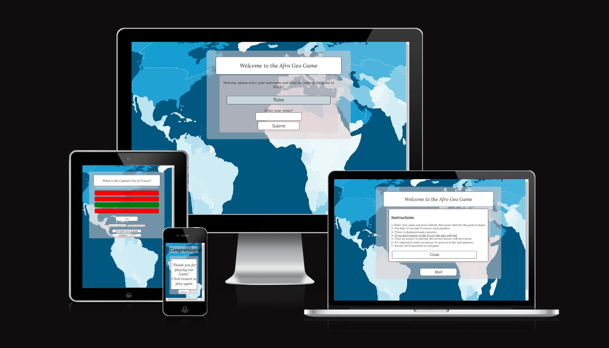

## Features

### Site wide

* Home Menu
    * This is the main page where users are welcome and introduced to the game.
    * This page will be responsive on all devices, making it possible to play the game on different devices.
    * Easy access to start the game.
    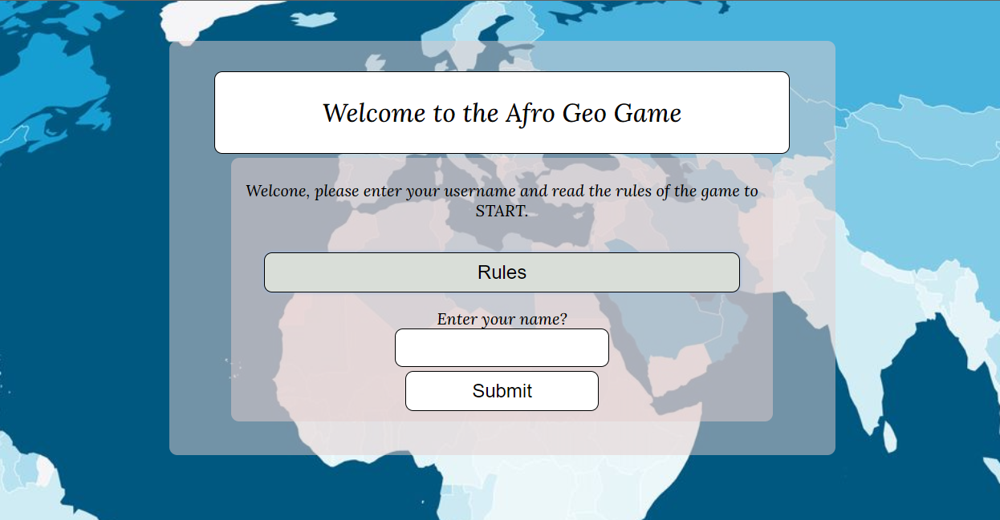

* Rules Menu
    * This aim to help to immediately show and entice the user what the website is about and how much fun they will have should they decide to proceed and play the game.
    * This allows the users to get to know the how to play the game.
    * This allows users to know how much time per question they have.    
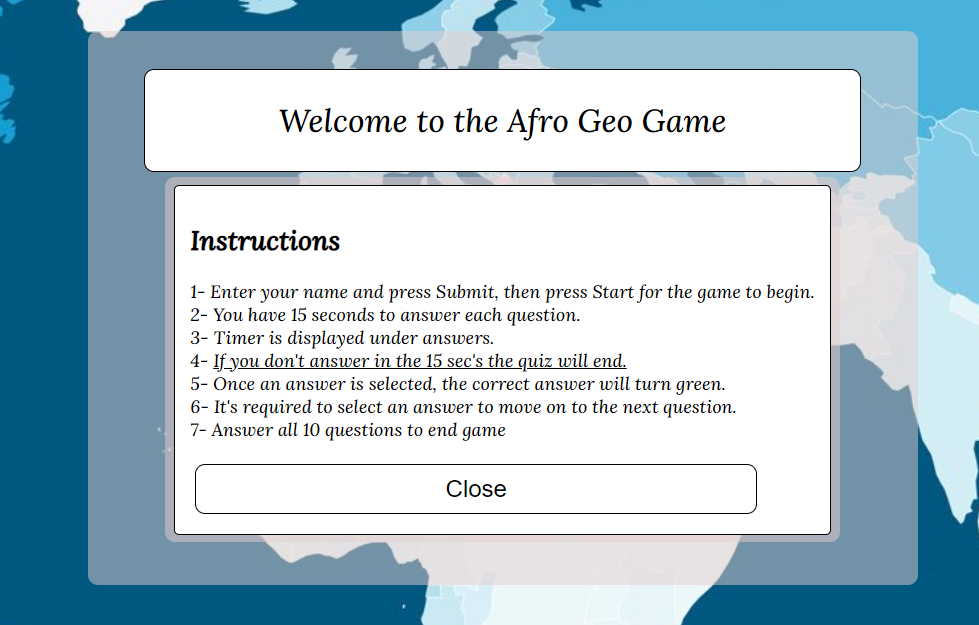

* Username
    * This is to allows the user enter a name of their choice.
    * Without entering a username, the error below will be displayed encourages the user to enter a name before starting the game.
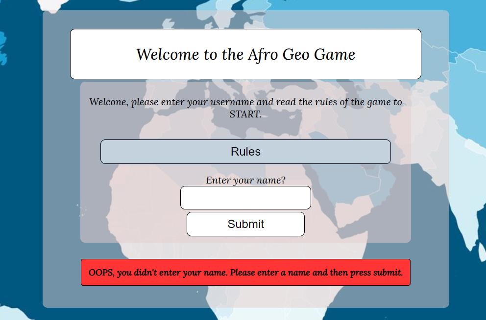

* Start Menu
    * The fun begins with a click.
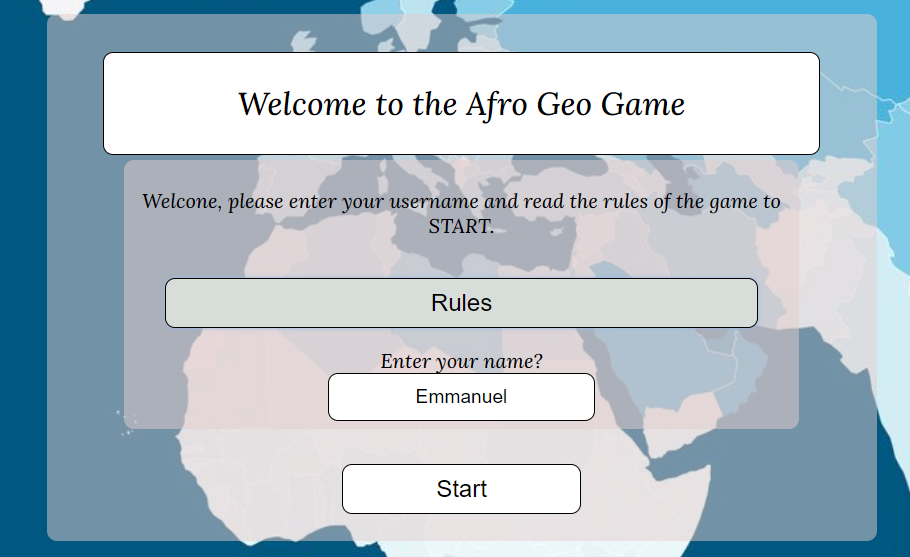

* Question Area
    * This displays the randomised questions with answers for the user to choice from.
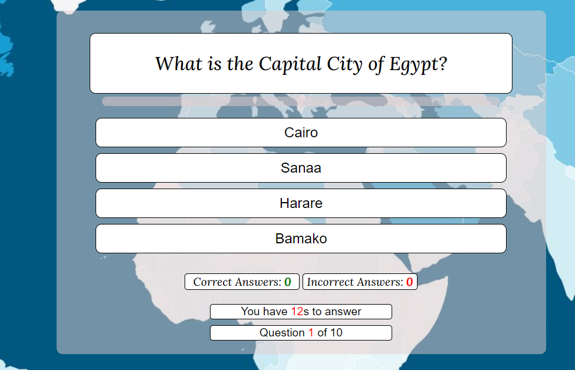
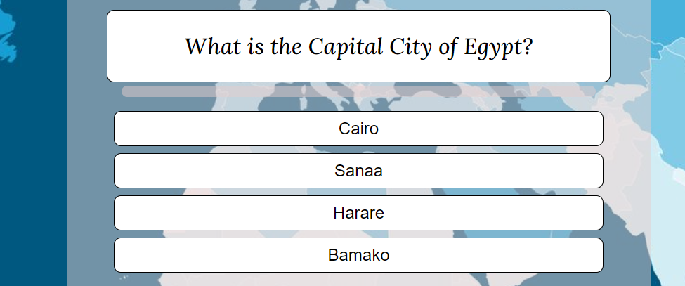

* Timerscore
    * This area displays the users current scores (correct and wrong answers), the 15 seconds timer till game ends and lastly the number of questions left to answer.

* Timererror
    * This part alerts the user of being timed off after 15 second of no answer.
    * This allows the user to restart the game and keep the timer in mind.
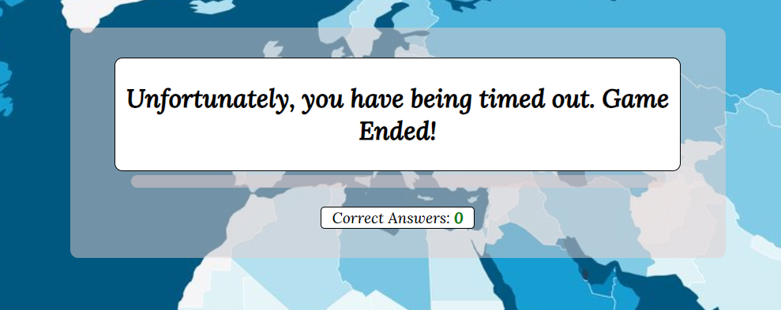
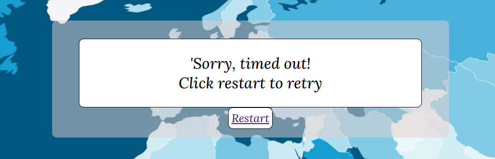

* QuestionAnswered
    * This displays the correct ann wrong answer in colour code.
    * Red colour correspond to wrong answers and Green correspond to correct answer.
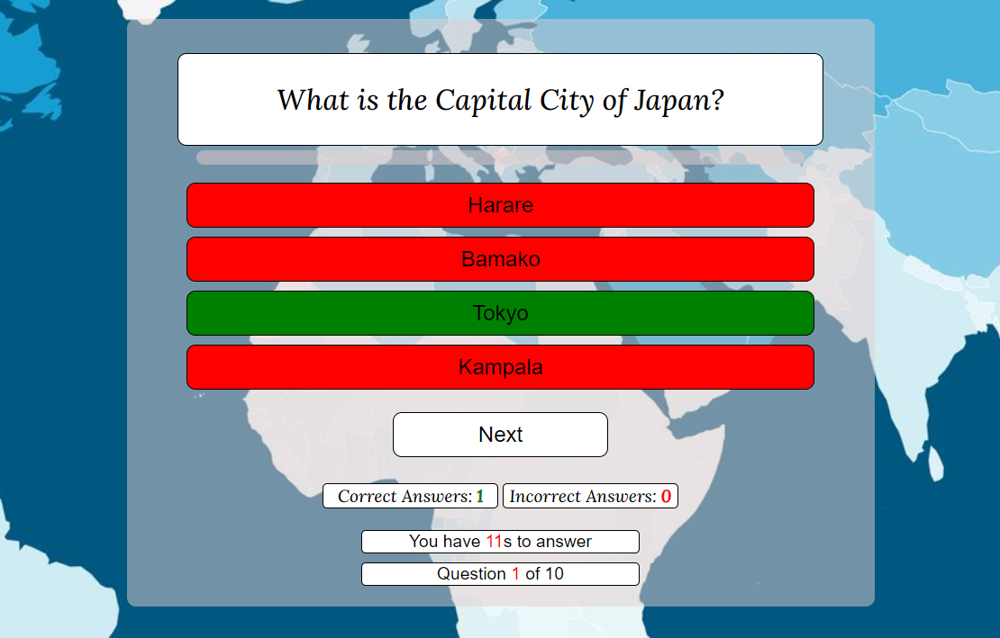
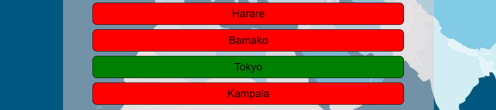

* ScoreDisplay and Restart
    * This displays to the user how many of the 10 question they got correct.
    * This congratulate the user for playing the game and provides a restart to replay.
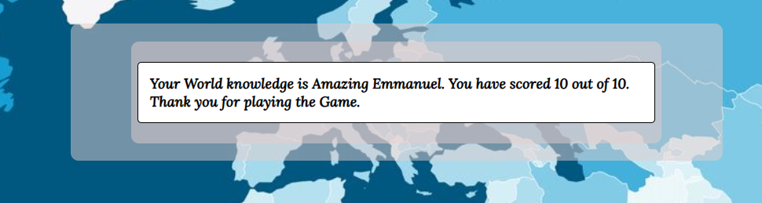
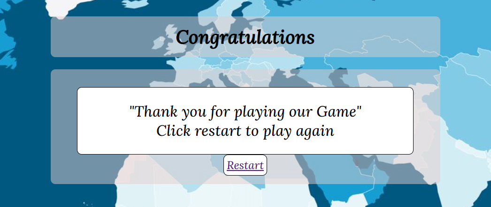

### Features left to implement
    * Add more countries and their capital to the game to increase the randomisation of questions.
    * Add great and fun geographical cities.
    * Add celestial constellation to incease geographical interest.
    * Add images of nature for identifying.

## Wireframes

### Home 
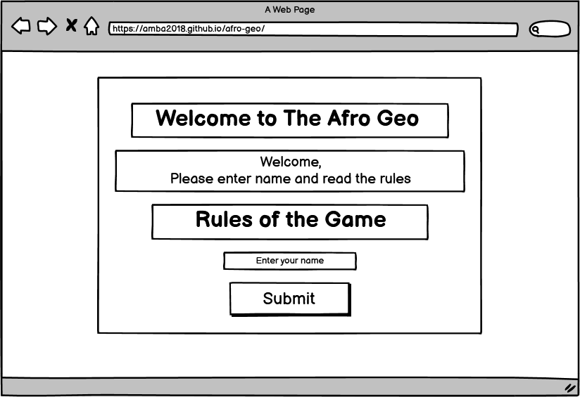
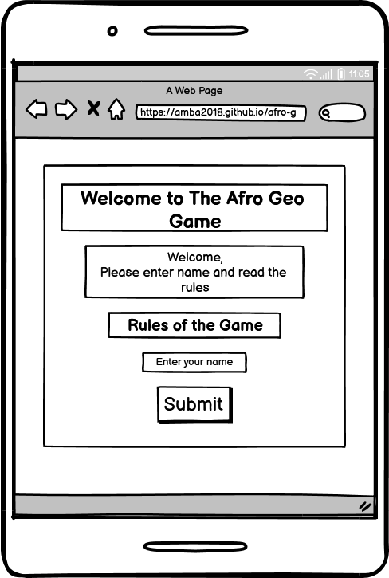

### Rules
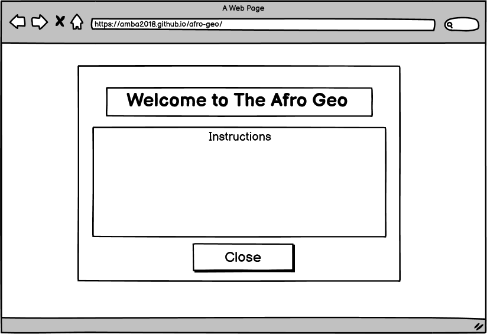

### UsernameStart
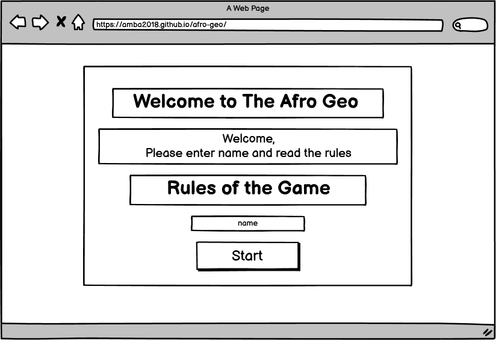

### QuestionAnswer & Timer

### Timeout
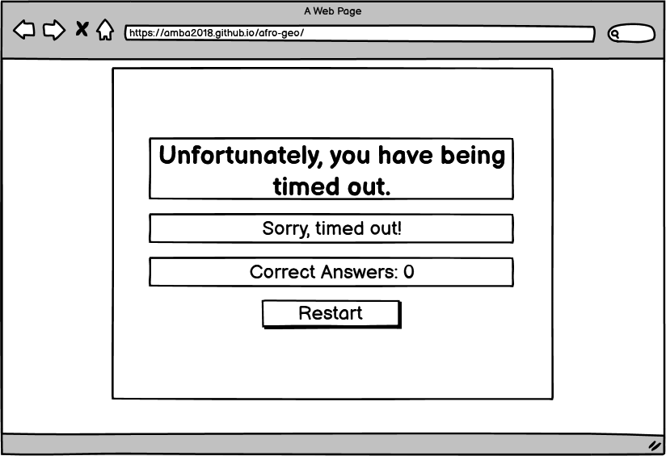

### ScoreDisplay
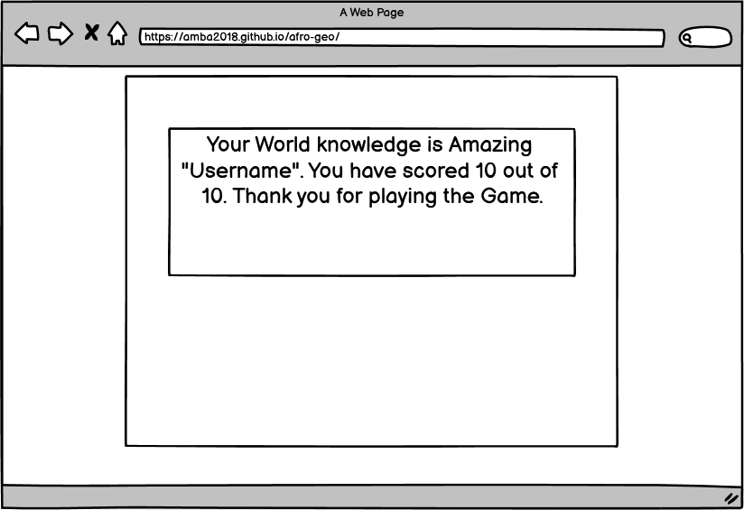

#### EndGame and Restart
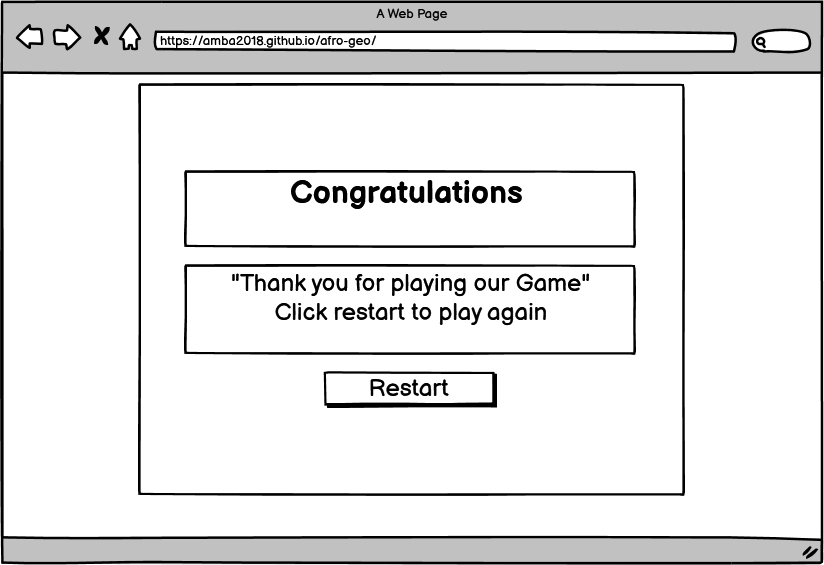
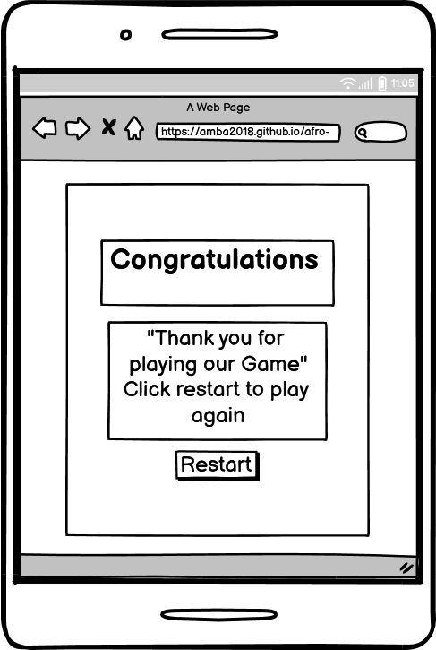

## Technolgies
* HTML
    * The structure of the Website was developed using HTML as the main language.
* CSS
    * The Website was styled using custom CSS in an external file.
* JavaScript
    * JavaScript was used to ensure interactivity.
* GitHub
    * Source code is hosted on GitHub and delpoyed using Git Pages.
* Git
    * Used to commit and push code during the development of the Website
* Font Awesome
    * Icons obtained from https://fontawesome.com/ were used as the Social media links in the footer section.
* Favicon.io
    * favicon files were created at https://favicon.io/favicon-converter/ 
* Balsamiq
    * Wireframes were created using balsamiq from https://balsamiq.com/wireframes/desktop/
* Replit
    * The website was first developed using this IDE before transfering to gitpod later.
* Gitpod
    * The website was developed using Gitpod IDE

## Testing

### Responsiveness

### Accessibility

## Deployment

### Version Control

### Deployment to Github Pages

### Clone the Repository Code Locally

## Credits 
