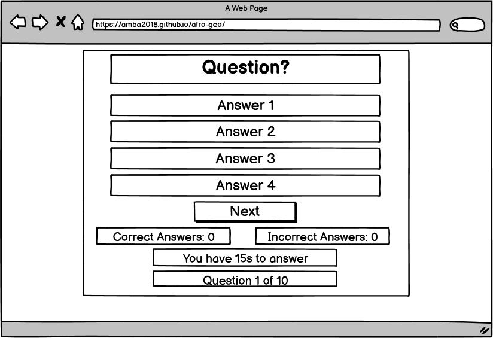

# Afro Geo Game
[Afro Geo](https://amba2018.github.io/afro-geo/) is a game built with JavaScript to teach children geography by guessing the capital city of various countries. It is a fun and engaging way to learn about the world and its countries. View the live site [here](https://amba2018.github.io/afro-geo/).

## Features

### Site wide

* Home Menu
    * This is the main page where users are welcome and introduced to the game.
    * 

### Features left to implement

## Wireframes

## Technolgies

## Testing

### Responsiveness

### Accessibility

## Deployment

### Version Control

### Deployment to Github Pages

### Clone the Repository Code Locally

## Credits 
