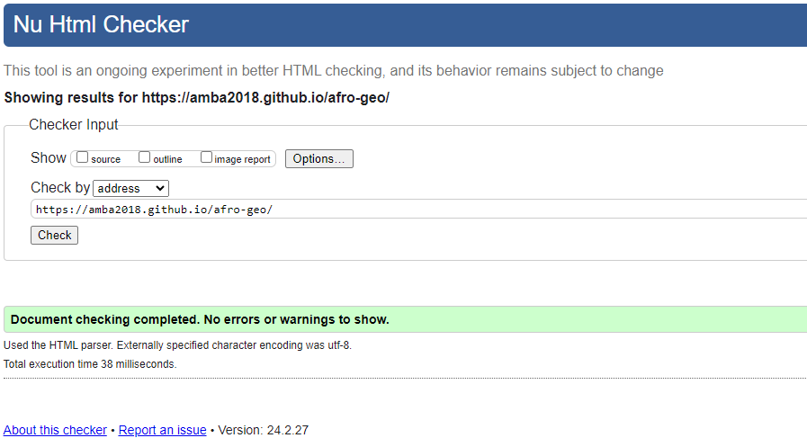
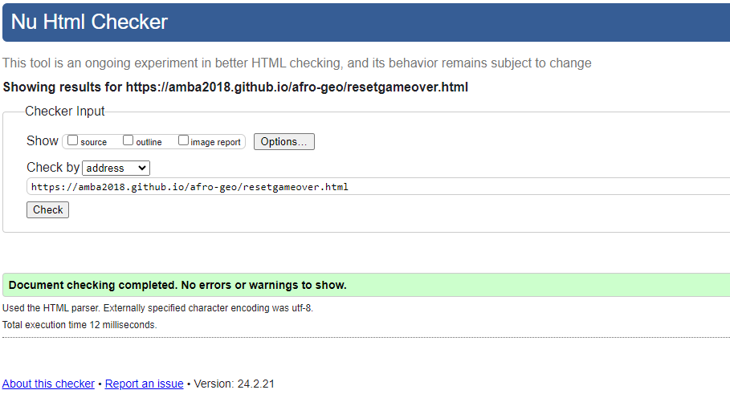
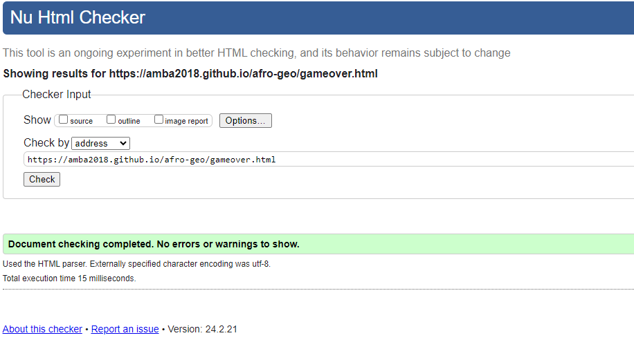
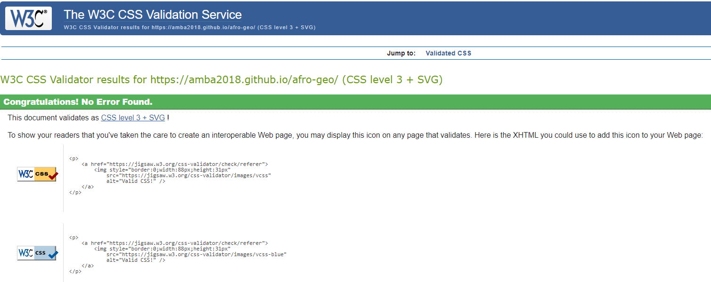
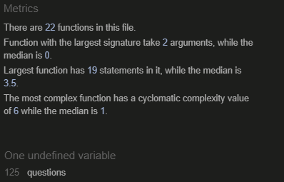
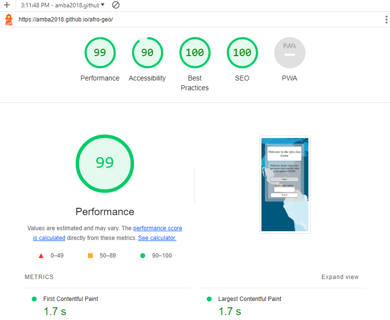
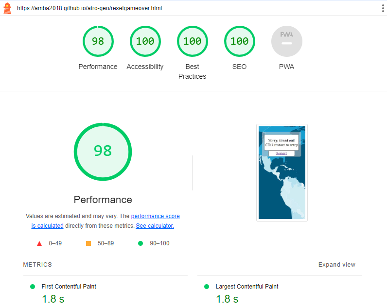
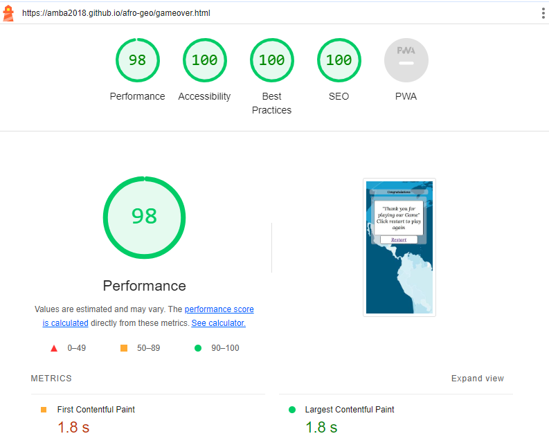

## Functional Testing

---

| Page       | Test                                                                                   | Completed successfully |
| :--------- | :------------------------------------------------------------------------------------- | :--------------------: |
| All        | Navigation links to relevant pages                                                     |          Yes           |
| All        | Navigation hover effect                                                                |          Yes           |
| All        | Navigation takes over 80% of the screen when toggled on mobile                         |          Yes           |
| Homepage   | Text flex responsively                                                                 |          Yes           |
| Homepage   | Username responds after submission                                                     |          Yes           |
| Homepage   | New game starts when user clicks 'Start' button                                        |          Yes           |
| Game       | New game loads questions randomly                                                      |          Yes           |
| Game       | Scoreboard increments number of correct and incorrect answers                          |          Yes           |
| Game       | Green border is applied to correct answer and red border is applied to incorrect answer|          Yes           |
| Game       | Push current question out of question array                                            |          Yes           |
| Game       | Time out and Reset                                                                     |          Yes           |
| Game       | Final Score is displayed                                                               |          Yes           |
| End Game   | Congratulations and Restart                                                            |          yes           |
| Game Score | Previous scores are displayed                                                          |          not yet       |

## Validator Testing

---

### HTML

[W3C Markup Validator](https://validator.w3.org/)

- No errors were returned when passing through the official W3S validator

Result

Home Page

ResetGameOver Page

Game Over Page

### CSS 

[W3C CSS Validator](https://jigsaw.w3.org/css-validator/)

This test returned no errors.
Results of the CSS test of style.css:

Result

- No errors were found when passing through the official (Jigsaw) validator
CSS Validator Results

### JS

[JSHint JS Validator](https://jshint.com/)

All JavaScript files were validated through JSHint.

Result

## LightHouse

---

Lighthouse was used (accessed through Developer Tools in Chrome) to analyse for the following:

- Performance
- Accessibility
- Best practice
- SEO

Homepage

ResetGameOver Page

GameOver Page

