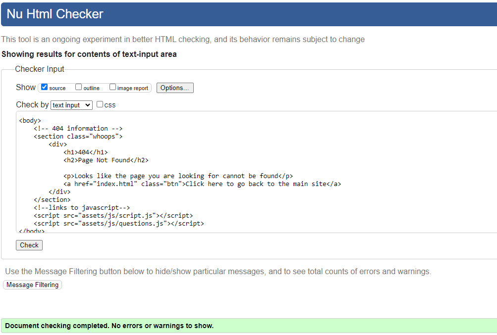
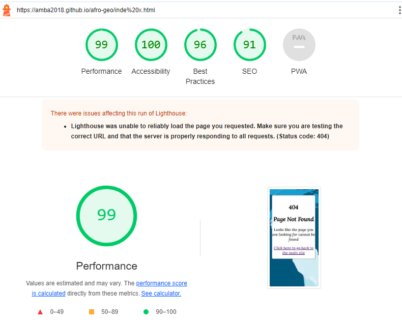

## Functional Testing

---

| Page       | Test                                                                                   | Completed successfully |
| :--------- | :------------------------------------------------------------------------------------- | :--------------------: |
| All        | Navigation links to relevant pages                                                     |          Yes           |
| All        | Navigation hover effect                                                                |          Yes           |
| All        | Navigation takes over 80% of the screen when toggled on mobile                         |          Yes           |
| Homepage   | Text flex responsively                                                                 |          Yes           |
| Homepage   | Username responds after submission                                                     |          Yes           |
| Homepage   | New game starts when user clicks 'Start' button                                        |          Yes           |
| Game       | New game loads questions randomly                                                      |          Yes           |
| Game       | Scoreboard increments number of correct and incorrect answers                          |          Yes           |
| Game       | Green border is applied to correct answer and red border is applied to incorrect answer|          Yes           |
| Game       | Push current question out of question array                                            |          Yes           |
| Game       | Time out and Reset                                                                     |          Yes           |
| Game       | Final Score is displayed                                                               |          Yes           |
| End Game   | Congratulations and Restart                                                            |          yes           |
| Game Score | Previous scores are displayed                                                          |          not yet       |

## Validator Testing

---

### HTML

[W3C Markup Validator](https://validator.w3.org/)

- No errors were returned when passing through the official W3S validator

Result

Home Page

ResetGameOver Page

Game Over Page

404 Page

### CSS 

[W3C CSS Validator](https://jigsaw.w3.org/css-validator/)

This test returned no errors.
Results of the CSS test of style.css:

Result

- No errors were found when passing through the official (Jigsaw) validator
CSS Validator Results

### JS

[JSHint JS Validator](https://jshint.com/)

All JavaScript files were validated through JSHint.

Result

## LightHouse

---

Lighthouse was used (accessed through Developer Tools in Chrome) to analyse for the following:

- Performance
- Accessibility
- Best practice
- SEO

Homepage

ResetGameOver Page

GameOver Page

404 Page

## Browser Compatibility

---

This website was tested on Chrome, Microsoft Edge, and Firefox for desktop.

The website was tested on Safari for mobile and tablet.

## Responsivity

---

### Responsiveness

All pages were tested to ensure responsiveness on screen sizes from 320px and upwards as defined in WCAG 2.1 Reflow criteria for responsive design on Chrome, Firefox and Edge browsers.

Responsiveness was tested through Chrome Developer tools. The devices tested include:

- iPhone SE
- iPhone XR
- iPhone 12 Pro
- Pixel 7
- Samsung Galaxy S8+
- Samsung Galaxy S20 Ultra
- iPad Air
- iPad Mini
- Surface Pro 7
- Surface Duo
- Galaxy Fold
- Samsung Galaxy A51

I was able to directly test the website on Samsung Galaxy A53, Samsung Galaxy S20+ and iPhone 14 Pro.

Steps to test:

1. Open browser 'Afro Geo'
2. Open the developer tools (right click and select inspect)
3. Set to responsive and decrease width to 320px
4. Set the zoom to 50%
5.  Click and drag the responsive window to maximum width.

Expected:

Website is responsive on all screen sizes.

Actual:

Website behaved as expected with the exception of switching to the viewport size to 320px. 

## Issues/ Bugs Found & Resolved

---

### Validation Issues

The initial W3S Mark Up Validation returned some errors because there were some unclosed tags. But I was able to resolve all of them on time.
The initial JsHint test results returned with a lot of "warnings" because of missing commas and unused variables. I was able to fix all of them.

